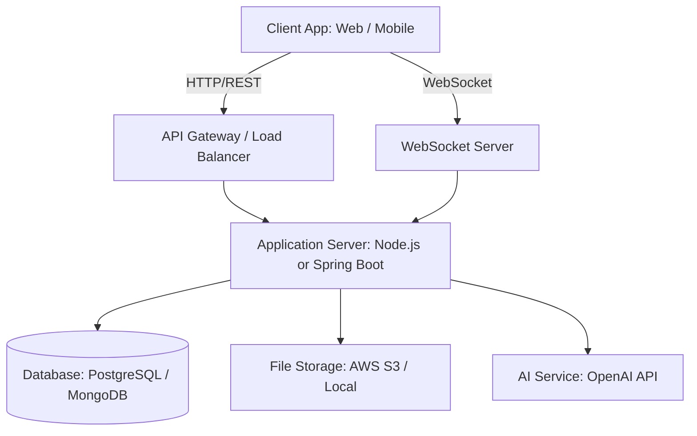
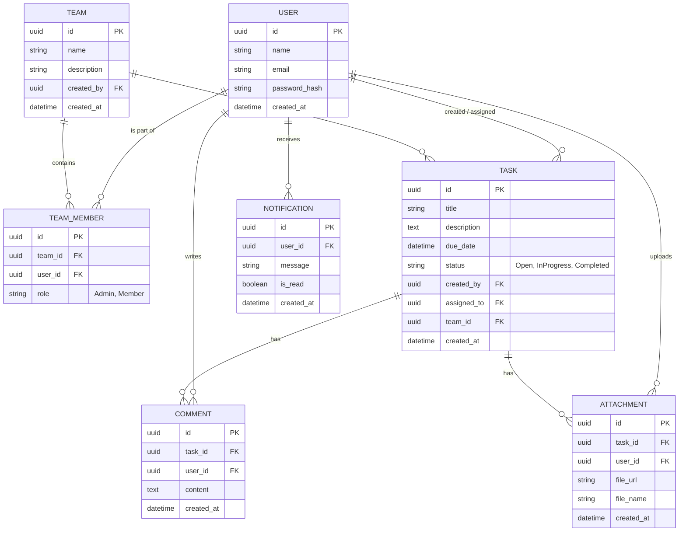

# TaskMaster System Architecture

This document outlines the detailed system architecture for the **TaskMaster** collaborative task tracking system based on the provided `problem-statement.md`.

## 1. High-Level System Architecture

The system will follow a classic Client-Server architecture with a RESTful API backend, a relational or NoSQL database, and optional real-time communication channels.

### Components:
*   **Client App:** Web or mobile interface consuming the RESTful APIs.
*   **Application Server:** The core backend built using **Node.js (Express)** or **Java (Spring Boot)**. It handles authentication, business logic, and database operations.
*   **Database:** A primary database (e.g., PostgreSQL for relational integrity or MongoDB for flexibility) to store users, tasks, teams, and comments.
*   **File Storage:** A service to store attachments (e.g., AWS S3, Cloudinary, or local file system).
*   **WebSocket Server:** For pushing real-time notifications to connected clients.
*   **AI Service:** Integration with an external API (like OpenAI) to auto-generate task descriptions.

---

## 2. Entity-Relationship (Data) Model

Here is the proposed data model representing the relationships between the core entities.

---

## 3. Core Modules & Services

To maintain a clean and maintainable codebase, the backend should be structured into distinct modules:

1.  **Auth Module:** Handles user registration, login (JWT generation), logout, and password hashing (e.g., bcrypt).
2.  **User Module:** Manages user profiles and information retrieval.
3.  **Team Module:** Handles creating teams/projects and inviting/adding team members.
4.  **Task Module:** The core module responsible for CRUD operations on tasks. It also implements searching, filtering (by status), and assignment logic.
5.  **Collaboration Module:** Handles adding comments and uploading/linking attachments to specific tasks.
6.  **Notification Module (Optional Extension):** Manages the WebSocket connections and broadcasts real-time events (e.g., "Task Assigned", "Task Updated").
7.  **AI Module (Optional Extension):** Interacts with LLM APIs to generate task descriptions from a title or short prompt.

---

## 4. RESTful API Endpoints Design

Below is a standardized RESTful API design to fulfill the user stories. All endpoints (except login/register) should be protected and require a valid JWT token.

### Authentication & Users
*   `POST /api/auth/register` - Create a new user account.
*   `POST /api/auth/login` - Authenticate user and return JWT.
*   `POST /api/auth/logout` - Invalidate user session.
*   `GET /api/users/profile` - Get logged-in user profile.
*   `PUT /api/users/profile` - Update user personal information.

### Teams & Projects
*   `POST /api/teams` - Create a new team/project.
*   `GET /api/teams` - List all teams the user belongs to.
*   `POST /api/teams/:teamId/members` - Invite/add a user to a team.
*   `GET /api/teams/:teamId/members` - List all members of a team.

### Tasks
*   `POST /api/tasks` - Create a new task (optionally within a team).
*   `GET /api/tasks` - View list of tasks.
    *   *Query Params:* `?status=open`, `?assignedTo=me`, `?search=keyword` for filtering and searching.
*   `GET /api/tasks/:taskId` - Get task details.
*   `PUT /api/tasks/:taskId` - Update full task details.
*   `PATCH /api/tasks/:taskId/status` - Mark a task as completed/in-progress.
*   `PATCH /api/tasks/:taskId/assign` - Assign task to a different team member.

### Collaboration
*   `POST /api/tasks/:taskId/comments` - Add a comment to a task.
*   `GET /api/tasks/:taskId/comments` - Get all comments for a task.
*   `POST /api/tasks/:taskId/attachments` - Upload an attachment for a task.

### Extensions (AI & Notifications)
*   `POST /api/tasks/generate-description` - Generate a description using AI based on a provided title/prompt.
*   *(WebSocket)* `ws://domain/notifications` - Connect to real-time notification stream.

---

## 5. Technology Stack Recommendations

Based on the requirements, here is a suggested tech stack:

### Option A: Node.js Ecosystem (Recommended for faster iteration)
*   **Framework:** Node.js + Express.js
*   **Database:** PostgreSQL (with Prisma ORM or Sequelize) or MongoDB (with Mongoose)
*   **Authentication:** `jsonwebtoken` (JWT), `bcrypt`
*   **File Uploads:** `multer` (for handling multipart/form-data)
*   **Real-time:** `socket.io`

### Option B: Java Ecosystem (Recommended for Enterprise scalability)
*   **Framework:** Java + Spring Boot
*   **Database:** PostgreSQL or MySQL (with Spring Data JPA / Hibernate)
*   **Authentication:** Spring Security + JWT
*   **File Uploads:** Spring Boot MultipartFile
*   **Real-time:** Spring WebSockets

---

## 6. Security & Best Practices
*   **Authentication:** Use HTTP-only cookies or Authorization headers with Bearer tokens for JWT.
*   **Authorization:** Ensure users can only view, edit, or comment on tasks within teams they belong to.
*   **Input Validation:** Use robust validation libraries (e.g., Zod, Joi in Node.js or standard Bean Validation in Spring) to prevent injection and bad data.
*   **Error Handling:** Implement a global error handler to return standardized error responses (e.g., `400 Bad Request`, `401 Unauthorized`, `404 Not Found`).
*   **Pagination:** Implement pagination for endpoints returning lists (tasks, comments) to ensure performance at scale.
